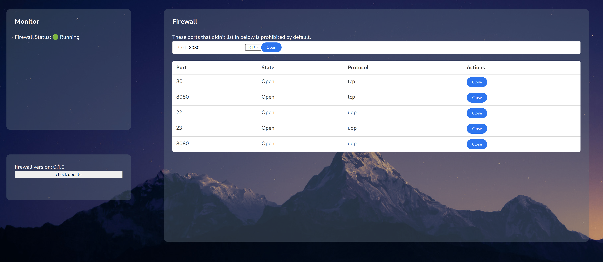

## What is Casaos-firewall
The Project is firewall manage tool for Casaos.



## Installation
run script
```shell
sh xxxxxxx
```

## Update
```shell
```

## Uninstall
run script
```shell
```

# Development
## Backend
Because casaos backend need root to execute some command. So air need sudo too.
```shell
sudo air -c scripts/.air.toml   
```
## Frontend
```shell
cd fronend
pnpm i
pnpm run dev
```
## Release
```shell
goreleaser build --rm-dist --snapshot -f .goreleaser.debug.yaml --id casaos-firewall-amd64 
```